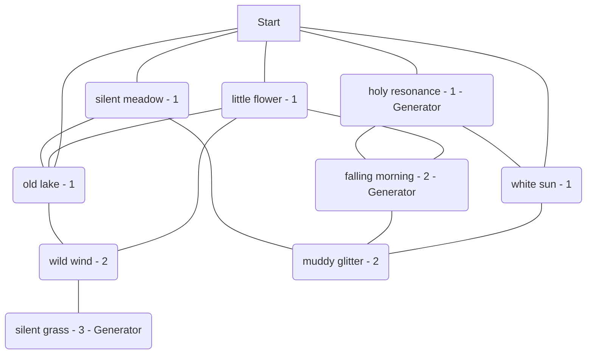

# Automatic Liberation Map

The goal of this project is to provide a class that can produce strings that Progbot can print out to run an almost automated liberation map. The strings it produces are vague prompts that are strong enough to do most of the decision making for the game master and give them inspiration for their own descriptions.

# Play Guide

Most of you clicking on this are looking for a play tool, not programming jargon. Everything Coding Style onwards is programming jargon. Heres what you want to know as a play tester

## Examples

[Click here](https://github.com/kinostl/Automatic-Liberation-Map/tree/main/examples) to open the Examples folder from that list above this. Inside you will find 8 example maps that I've uploaded. Find one you like, they were all generated using this program.

## Running and Playing in an Automated Liberation Mission

Every Liberation Map comes with a dungeon boss, who is a random megavirus. The goal of the Liberation Map by default is to defeat the boss. To do this you'll need to destroy its signal nodes - which are generators. These generators are also the keys to the dungeon so to say. A lot of this was built on Legend of Zelda inspired technology, so the phrase dungeon might be thrown here or there.

Every Liberation Map has 3 "Difficulty Levels". A difficulty level determines how many viruses or hazards it spawns, and what style of Mystery Data it spawns. These are represented by the numbers on the map and the "Level 1" or "Level 2" or similar on the descriptions. A difficulty represents a span of 15 minutes at time of writing. If that doesn't work out to be the reality for you, please adjust accordingly. I suggest opening up new shortcuts, providing powerful one-off chips, or having the boss come to the party.

When you destroy a Difficulty Level's Generator you'll gain access to the next Difficulty Level. That is to say, you can access Difficulty Level 1 Nodes for free. To access the Level 2 Nodes, you'll need to destroy the Level 1 Generator. Similarly, you'll need to destroy the Level 2 Generator to access the Level 3 Node with the boss. 

The Game Master will be provided some pretty terse notes meant to act as more of a prompt. Treat this like a coloring book. Bring your own descriptions, flair, and context. You can drop these into any situation, they're pretty by the book. Each dungeon tries to fit a theme in its element choices as well. There should be a pretty even mix of viruses and hazards, so feel free to invite any combination of players in a standard format for 4 hours of gameplay. 

This is also all very by the book, so you should feel safe there as well - Be a bit more mechanically literal than you normally would, and be on the look out for how generators might effect the gameplay. You'll want to check what the generators are and make a note of them somewhere, and reference them constantly to see if they're taking effect. They add a lot of the variety to the mission and introduce a lot of the additional danger that prevents anyone from being too comfortable for too long.

## Can I share the map with my players?

Honestly I suggest it. This is very hard to interpret otherwise. The future version plans to do a lot more note taking for everyone and use Progbot to handle the transitions between nodes. This should take a lot of handiwork off the Game Master and let them focus on interpetation instead, but for right now this seems like a standard amount of effort for a GM to accept when running a premade adventure.

## I want to roll my own map!

Thats cool! You can clone this repo and then run printLiberationMap.py, it'll give you github flavored markdown that you can put into a gist or something to get pretty formatting.

## I want to modify this for something else!

Yeah, feel free. The code in this is MIT licensed but make sure you change the EncounterConfig and Encounters files. Those aren't using copy I've made. They were written by Will Uhl.

# Coding Style

I don't want to deal with pip for whats essentially a library, so I'm trying to keep everything batteries included for python 3.8, if you're contributing I'd appreciate that being respected, but I'll understand if the scope changes from there. I'll probably be approaching code reviews with that in mind

# What this does not do

This is going to handle some amount of memory, like fog of war and cleared tiles, but all the controls will be handled by Progbot or as another file inside this to act as glue. So things should be designed with that in mind. It'd be nice to be able to reuse this for other projects as wanted, the concepts in here are very globally applied and the EncounterConfig file gives a lot of flexibility to that. Future versions should probably remove the need to fork this to use it, that'd be nice.

# Example Outputs

This is what you get literally if you run it.

```
flowchart TD
	jAZVyMQo(little flower - 1) --- oiBINLWc(wild wind - 2)
	zsiIKJpf(white sun - 1) --- rboFBegQ(muddy glitter - 2)
	gwzNIcxp(old lake - 1) --- oiBINLWc(wild wind - 2)
	jAZVyMQo(little flower - 1) --- jEJNfQOG(falling morning - 2 - Generator)
	oSuztwaK(holy resonance - 1 - Generator) --- jEJNfQOG(falling morning - 2 - Generator)
	Start --- DFmjauPT(silent meadow - 1)
	Start --- zsiIKJpf(white sun - 1)
	jEJNfQOG(falling morning - 2 - Generator) --- rboFBegQ(muddy glitter - 2)
	oiBINLWc(wild wind - 2) --- zsDgyiOr(silent grass - 3 - Generator)
	Start --- gwzNIcxp(old lake - 1)
	Start --- oSuztwaK(holy resonance - 1 - Generator)
	jAZVyMQo(little flower - 1) --- gwzNIcxp(old lake - 1)
	oSuztwaK(holy resonance - 1 - Generator) --- zsiIKJpf(white sun - 1)
	DFmjauPT(silent meadow - 1) --- gwzNIcxp(old lake - 1)
	Start --- jAZVyMQo(little flower - 1)
	DFmjauPT(silent meadow - 1) --- rboFBegQ(muddy glitter - 2)
---
Expected Play Time: 3.5
---
old lake *(Level 1 - ? - threat)*
little flower *(Level 1 - ? - threat)*
holy resonance *(Level 1 - ? - threat)*
white sun *(Level 1 - ? - threat)*
silent meadow *(Level 1 - ? - threat)*
wild wind *(Level 2 - ? - threat,threat)*
falling morning *(Level 2 - ? - threat,threat)*
muddy glitter *(Level 2 - ? - threat,threat)*
silent grass *(Level 3 - ? - threat,threat)*
```

Threat will be less generic things like `fire` or `mettaur` representing viruses or hazards or the like. The `?` represents why type of tile it is, and might be removed at some point, since the collection of threats is more versatile than the guidance of what the tile type is. A player can't move to the next level until they've deleted the generator/signal node of their current level.

The final node of every one of these maps spends one of its threats on a megavirus. This might travel based on the type it is, but this is up to the GM to do.

This is the type of dungeon it creates. The players probably won't be presented this, this is just for documentation purposes. The game master might receive it.



# Example Node

This is its own section because it is. This is what a node looks like. It contains a lot of information. Well, it looks something like this anyway. Anything thats obviously a filler word like `threat` or `alarm test` or `lock` is because the default getEncounter currently just returns the string its passed unless its alarm in which case it does a little logic for the getEncounters() function down the line. getEncounters() should probably be renamed to something more generic like getRoomDescription(). This is very muddy. Like MUD the software.

Its all very much output made for Progbot to interact with or any other bot that can receive emojis and spit out outputs somehow. This usually means Discord but I don't know what the future is. This might be more like a normal dictionary or something or left up to the implementer to decide what to do with but for right now I want this here instead of there. It might turn into a translation layer or something but thats over complicating something that very likely has a narrow usecase.

> **Hidden Leaf** _Level 2 Puzzle_
>
> **Countdown** 8  
> **Alarm** Hazards! Spawns random element from the Art table. _(Its probably a good idea to base this off the difficulty level. Either roll an additional element for each difficulty level or increase how far it spreads or mention that its tougher than Normal. Maybe make it weaker if its a lower difficulty and it seems right. Such as making it Easy or single target.)_  
> **Lockbox** Lockbox
>
> **Threats** Miramira _(Virus)_, BlotOut _(Virus)_  
> **Generator** Shaker
>
> **Exits**  
> :one: Cool River _(Level 1 - Social - Ceramics _(Hazard)_)_  
> :two: Dark Glitter _(Level 2 - Puzzle - Jazz _(Hazard)_, Strings _(Hazard)_)_

Each map comes with 1 Mystery Data per Difficulty Level.  
Each map comes with 1 Boss at the Max Difficulty Level.

# Sources

Shoutout to this article for inspiring a lot of the code in this by writing and sharing [The Zelda Dungeon Generator:
Adopting Generative Grammars to
Create Levels for Action-Adventure
Games by Lavender](http://beckylavender.co.uk/wp-content/uploads/2017/11/ZDG_Dissertation.pdf). Specifically her study of Lenna's Inception in section 2.5.2
