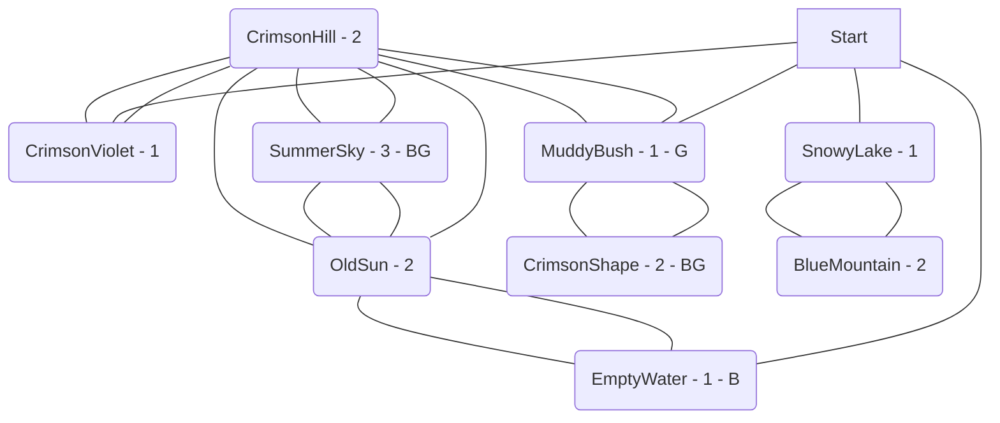

# SummerSky.ORG  
Expected Play Time: 3.75  
  

  
---  
  
EmptyWater *(Level 1 - Puzzle - EggMecha *(Virus)*)*  
SnowyLake *(Level 1 - Social - Jewels *(Hazard)*)*  
MuddyBush *(Level 1 - Puzzle - LifeTree *(Virus)*)*  
CrimsonViolet *(Level 1 - Fight - Carpentry *(Hazard)*)*  
OldSun *(Level 2 - Social - Ink *(Hazard)*, Catack *(Virus)*)*  
BlueMountain *(Level 2 - Fight - Masks *(Hazard)*, MeloDeep *(Virus)*)*  
CrimsonShape *(Level 2 - Fight - HardHead *(Virus)*, KillPlant *(Virus)*)*  
CrimsonHill *(Level 2 - Fight - BlackBlossom *(Virus)*, Jewels *(Hazard)*)*  
SummerSky *(Level 3 - Fight - Pianos *(Hazard)*, Ribbons *(Hazard)*, Scuttlest *(Boss)*)*  
  
---  
  
**EmptyWater** *Level 1 Puzzle*  
  
**Countdown** 11  
**Alarm** Hazards! Spawns random element from the Art table. *(Its probably a good idea to base this off the difficulty level. Either roll an additional element for each difficulty level or increase how far it spreads or mention that its tougher than Normal. Maybe make it weaker if its a lower difficulty and it seems right. Such as making it Easy or single target.)*  
**Lockbox** StealthLock  
  
**Threats** EggMecha *(Virus)*  
**Benefit** Common Mystery Data  
  
**Connections**  
:zero: Start *(Level 0 - Safe - )*  
:one: OldSun *(Level 2 - Social - Ink *(Hazard)*, Catack *(Virus)*)*  
  
---  
  
**SnowyLake** *Level 1 Social*  
  
**Countdown** 4  
**Alarm** High alert! All of the adjacent tiles have their Countdown reduced by the difficulty level. *(Tiles are adjacent if they share a connection. This mostly means the GM needs to check the chart.)*  
**Lockbox** StealthLock  
  
**Threats** Jewels *(Hazard)*  
  
**Connections**  
:zero: Start *(Level 0 - Safe - )*  
:one: BlueMountain *(Level 2 - Fight - Masks *(Hazard)*, MeloDeep *(Virus)*)*  
  
---  
  
**MuddyBush** *Level 1 Puzzle*  
  
**Countdown** 9  
**Alarm** Backup! - Spawns random viruses. *(I would suggest doing this based on the difficulty level somehow. Like making the number of viruses equal to the difficulty. Either that or having them spawn on multiple tiles.)*  
**Lockbox** CryptoLock  
  
**Threats** LifeTree *(Virus)*  
**Generator** Spawner  
  
**Connections**  
:zero: Start *(Level 0 - Safe - )*  
:one: CrimsonHill *(Level 2 - Fight - BlackBlossom *(Virus)*, Jewels *(Hazard)*)*  
:two: CrimsonShape *(Level 2 - Fight - HardHead *(Virus)*, KillPlant *(Virus)*)*  
  
---  
  
**CrimsonViolet** *Level 1 Fight*  
  
**Countdown** 11  
**Alarm** Hazards! Spawns random element from the Art table. *(Its probably a good idea to base this off the difficulty level. Either roll an additional element for each difficulty level or increase how far it spreads or mention that its tougher than Normal. Maybe make it weaker if its a lower difficulty and it seems right. Such as making it Easy or single target.)*  
**Lockbox** SyncLock  
  
**Threats** Carpentry *(Hazard)*  
  
**Connections**  
:zero: Start *(Level 0 - Safe - )*  
:one: CrimsonHill *(Level 2 - Fight - BlackBlossom *(Virus)*, Jewels *(Hazard)*)*  
  
---  
  
**OldSun** *Level 2 Social*  
  
**Countdown** 11  
**Alarm** High alert! All of the adjacent tiles have their Countdown reduced by the difficulty level. *(Tiles are adjacent if they share a connection. This mostly means the GM needs to check the chart.)*  
**Lockbox** StealthLock  
  
**Threats** Ink *(Hazard)*, Catack *(Virus)*  
  
**Connections**  
:one: CrimsonHill *(Level 2 - Fight - BlackBlossom *(Virus)*, Jewels *(Hazard)*)*  
:two: SummerSky *(Level 3 - Fight - Pianos *(Hazard)*, Ribbons *(Hazard)*, Scuttlest *(Boss)*)*  
:three: EmptyWater *(Level 1 - Puzzle - EggMecha *(Virus)*)*  
  
---  
  
**BlueMountain** *Level 2 Fight*  
  
**Countdown** 4  
**Alarm** Hazards! Spawns random element from the Art table. *(Its probably a good idea to base this off the difficulty level. Either roll an additional element for each difficulty level or increase how far it spreads or mention that its tougher than Normal. Maybe make it weaker if its a lower difficulty and it seems right. Such as making it Easy or single target.)*  
**Lockbox** Lockbox  
  
**Threats** Masks *(Hazard)*, MeloDeep *(Virus)*  
  
**Connections**  
:one: SnowyLake *(Level 1 - Social - Jewels *(Hazard)*)*  
  
---  
  
**CrimsonShape** *Level 2 Fight*  
  
**Countdown** 7  
**Alarm** High alert! All of the adjacent tiles have their Countdown reduced by the difficulty level. *(Tiles are adjacent if they share a connection. This mostly means the GM needs to check the chart.)*  
**Lockbox** CryptoLock  
  
**Threats** HardHead *(Virus)*, KillPlant *(Virus)*  
**Benefit** Common Mystery Data  
**Generator** Spawner  
  
**Connections**  
:one: MuddyBush *(Level 1 - Puzzle - LifeTree *(Virus)*)*  
  
---  
  
**CrimsonHill** *Level 2 Fight*  
  
**Countdown** 9  
**Alarm** Hazards! Spawns random element from the Art table. *(Its probably a good idea to base this off the difficulty level. Either roll an additional element for each difficulty level or increase how far it spreads or mention that its tougher than Normal. Maybe make it weaker if its a lower difficulty and it seems right. Such as making it Easy or single target.)*  
**Lockbox** SyncLock  
  
**Threats** BlackBlossom *(Virus)*, Jewels *(Hazard)*  
  
**Connections**  
:one: CrimsonViolet *(Level 1 - Fight - Carpentry *(Hazard)*)*  
:two: SummerSky *(Level 3 - Fight - Pianos *(Hazard)*, Ribbons *(Hazard)*, Scuttlest *(Boss)*)*  
:three: MuddyBush *(Level 1 - Puzzle - LifeTree *(Virus)*)*  
:four: OldSun *(Level 2 - Social - Ink *(Hazard)*, Catack *(Virus)*)*  
  
---  
  
**SummerSky** *Level 3 Fight*  
  
**Countdown** 4  
**Alarm** Backup! - Spawns random viruses. *(I would suggest doing this based on the difficulty level somehow. Like making the number of viruses equal to the difficulty. Either that or having them spawn on multiple tiles.)*  
**Lockbox** ProgLock  
  
**Threats** Pianos *(Hazard)*, Ribbons *(Hazard)*, Scuttlest *(Boss)*  
**Benefit** Uncommon Mystery Data  
**Generator** Spawner  
  
**Connections**  
:one: CrimsonHill *(Level 2 - Fight - BlackBlossom *(Virus)*, Jewels *(Hazard)*)*  
:two: OldSun *(Level 2 - Social - Ink *(Hazard)*, Catack *(Virus)*)*  
  
---  

