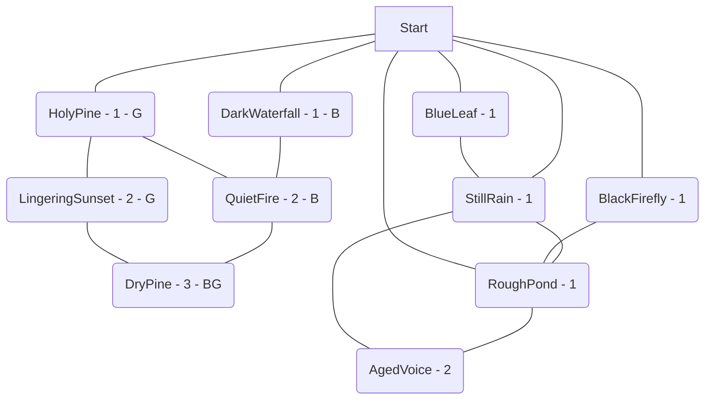

# DryPine.MIL  
  

  
Expected Play Time: 3.75  
  
---  
  
HolyPine *(Level 1 - Social - LifeTree *(Virus)*)*  
BlackFirefly *(Level 1 - Puzzle - Fandom *(Hazard)*)*  
RoughPond *(Level 1 - Puzzle - Garbage *(Hazard)*)*  
StillRain *(Level 1 - Fight - Advertisements *(Hazard)*)*  
BlueLeaf *(Level 1 - Fight - Peanut Butter *(Hazard)*)*  
DarkWaterfall *(Level 1 - Social - Ripples *(Hazard)*)*  
LingeringSunset *(Level 2 - Puzzle - Snaggit *(Virus)*, Snaggit *(Virus)*)*  
AgedVoice *(Level 2 - Puzzle - Snaggit *(Virus)*, Lunatic *(Virus)*)*  
QuietFire *(Level 2 - Social - Handy *(Virus)*, Politics *(Hazard)*)*  
DryPine *(Level 3 - Puzzle - WindBox *(Virus)*, Fishy *(Virus)*, Anomaly *(Boss)*)*  
  
---  
  
**HolyPine** *Level 1 Social*  
  
**Countdown** 11  
**Alarm** Backup! - Spawns random viruses. *(I would suggest doing this based on the difficulty level somehow. Like making the number of viruses equal to the difficulty. Either that or having them spawn on multiple tiles.)*  
**Lockbox** Lockbox  
  
**Threats** LifeTree *(Virus)*  
**Generator** Shaker  
  
**Exits**  
:one: LingeringSunset *(Level 2 - Puzzle - Snaggit *(Virus)*, Snaggit *(Virus)*)*  
:two: QuietFire *(Level 2 - Social - Handy *(Virus)*, Politics *(Hazard)*)*  
**BlackFirefly** *Level 1 Puzzle*  
  
**Countdown** 5  
**Alarm** High alert! All of the adjacent tiles have their Countdown reduced by the difficulty level. *(Tiles are adjacent if they share a connection. This mostly means the GM needs to check the chart.)*  
**Lockbox** StealthLock  
  
**Threats** Fandom *(Hazard)*  
  
**Exits**  
:one: RoughPond *(Level 1 - Puzzle - Garbage *(Hazard)*)*  
**RoughPond** *Level 1 Puzzle*  
  
**Countdown** 8  
**Alarm** Backup! - Spawns random viruses. *(I would suggest doing this based on the difficulty level somehow. Like making the number of viruses equal to the difficulty. Either that or having them spawn on multiple tiles.)*  
**Lockbox** ProgLock  
  
**Threats** Garbage *(Hazard)*  
  
**Exits**  
:one: StillRain *(Level 1 - Fight - Advertisements *(Hazard)*)*  
:two: BlackFirefly *(Level 1 - Puzzle - Fandom *(Hazard)*)*  
:three: AgedVoice *(Level 2 - Puzzle - Snaggit *(Virus)*, Lunatic *(Virus)*)*  
**StillRain** *Level 1 Fight*  
  
**Countdown** 8  
**Alarm** Backup! - Spawns random viruses. *(I would suggest doing this based on the difficulty level somehow. Like making the number of viruses equal to the difficulty. Either that or having them spawn on multiple tiles.)*  
**Lockbox** ProgLock  
  
**Threats** Advertisements *(Hazard)*  
  
**Exits**  
:one: RoughPond *(Level 1 - Puzzle - Garbage *(Hazard)*)*  
:two: BlueLeaf *(Level 1 - Fight - Peanut Butter *(Hazard)*)*  
:three: AgedVoice *(Level 2 - Puzzle - Snaggit *(Virus)*, Lunatic *(Virus)*)*  
**BlueLeaf** *Level 1 Fight*  
  
**Countdown** 10  
**Alarm** High alert! All of the adjacent tiles have their Countdown reduced by the difficulty level. *(Tiles are adjacent if they share a connection. This mostly means the GM needs to check the chart.)*  
**Lockbox** ProgLock  
  
**Threats** Peanut Butter *(Hazard)*  
  
**Exits**  
:one: StillRain *(Level 1 - Fight - Advertisements *(Hazard)*)*  
**DarkWaterfall** *Level 1 Social*  
  
**Countdown** 9  
**Alarm** High alert! All of the adjacent tiles have their Countdown reduced by the difficulty level. *(Tiles are adjacent if they share a connection. This mostly means the GM needs to check the chart.)*  
**Lockbox** ProgLock  
  
**Threats** Ripples *(Hazard)*  
**Benefit** Common Mystery Data  
  
**Exits**  
:one: QuietFire *(Level 2 - Social - Handy *(Virus)*, Politics *(Hazard)*)*  
**LingeringSunset** *Level 2 Puzzle*  
  
**Countdown** 6  
**Alarm** Backup! - Spawns random viruses. *(I would suggest doing this based on the difficulty level somehow. Like making the number of viruses equal to the difficulty. Either that or having them spawn on multiple tiles.)*  
**Lockbox** Lockbox  
  
**Threats** Snaggit *(Virus)*, Snaggit *(Virus)*  
**Generator** Shaker  
  
**Exits**  
:one: HolyPine *(Level 1 - Social - LifeTree *(Virus)*)*  
:two: DryPine *(Level 3 - Puzzle - WindBox *(Virus)*, Fishy *(Virus)*, Anomaly *(Boss)*)*  
**AgedVoice** *Level 2 Puzzle*  
  
**Countdown** 9  
**Alarm** Backup! - Spawns random viruses. *(I would suggest doing this based on the difficulty level somehow. Like making the number of viruses equal to the difficulty. Either that or having them spawn on multiple tiles.)*  
**Lockbox** Lockbox  
  
**Threats** Snaggit *(Virus)*, Lunatic *(Virus)*  
  
**Exits**  
:one: RoughPond *(Level 1 - Puzzle - Garbage *(Hazard)*)*  
:two: StillRain *(Level 1 - Fight - Advertisements *(Hazard)*)*  
**QuietFire** *Level 2 Social*  
  
**Countdown** 4  
**Alarm** High alert! All of the adjacent tiles have their Countdown reduced by the difficulty level. *(Tiles are adjacent if they share a connection. This mostly means the GM needs to check the chart.)*  
**Lockbox** CryptoLock  
  
**Threats** Handy *(Virus)*, Politics *(Hazard)*  
**Benefit** Common Mystery Data  
  
**Exits**  
:one: DarkWaterfall *(Level 1 - Social - Ripples *(Hazard)*)*  
:two: HolyPine *(Level 1 - Social - LifeTree *(Virus)*)*  
:three: DryPine *(Level 3 - Puzzle - WindBox *(Virus)*, Fishy *(Virus)*, Anomaly *(Boss)*)*  
**DryPine** *Level 3 Puzzle*  
  
**Countdown** 9  
**Alarm** Backup! - Spawns random viruses. *(I would suggest doing this based on the difficulty level somehow. Like making the number of viruses equal to the difficulty. Either that or having them spawn on multiple tiles.)*  
**Lockbox** CryptoLock  
  
**Threats** WindBox *(Virus)*, Fishy *(Virus)*, Anomaly *(Boss)*  
**Benefit** Uncommon Mystery Data  
**Generator** Shaker  
  
**Exits**  
:one: LingeringSunset *(Level 2 - Puzzle - Snaggit *(Virus)*, Snaggit *(Virus)*)*  
:two: QuietFire *(Level 2 - Social - Handy *(Virus)*, Politics *(Hazard)*)*
